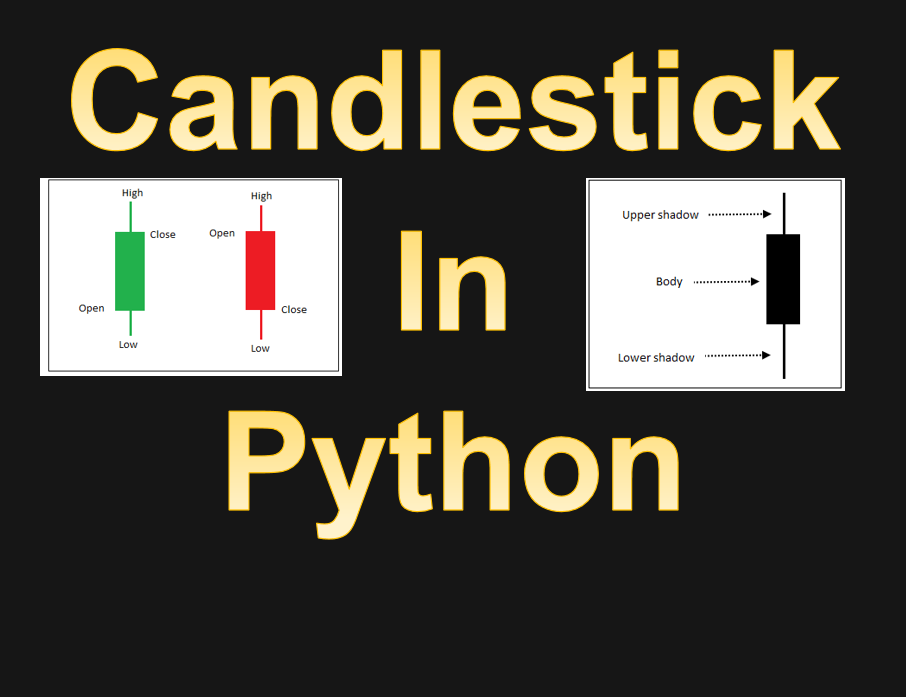
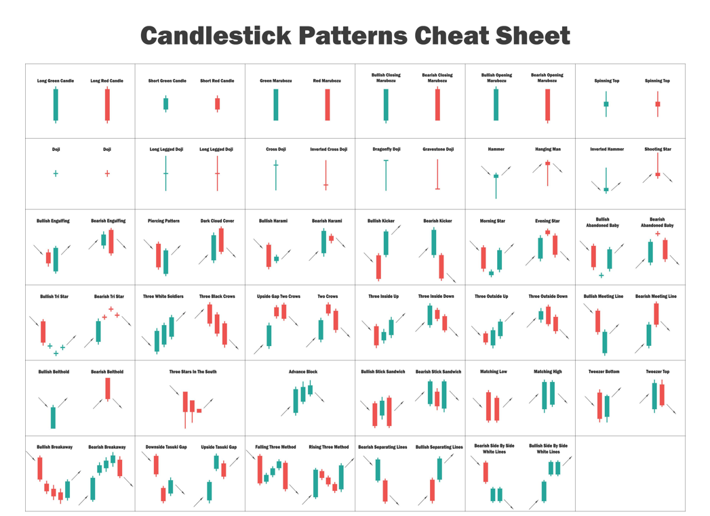
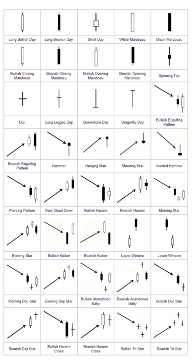
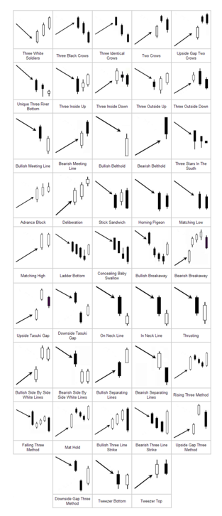
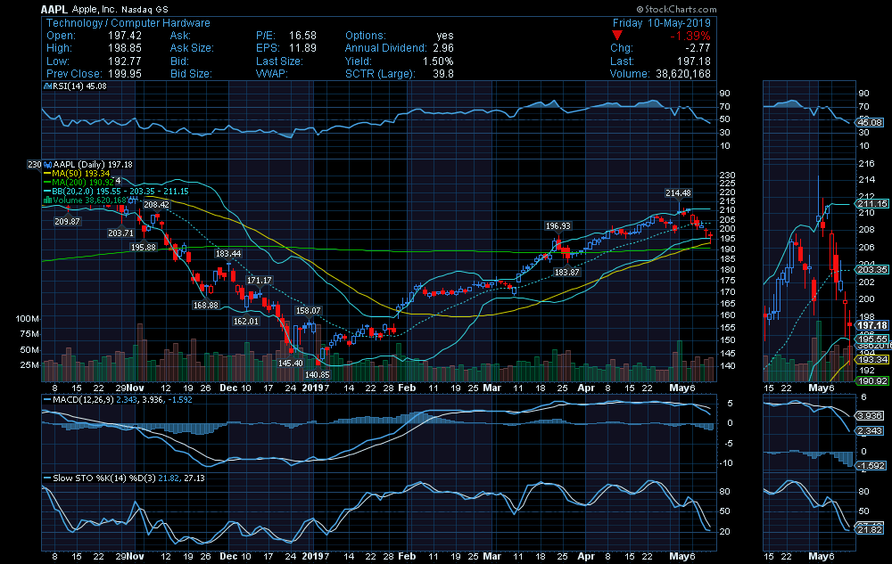

# Stock Analysis for Quants  

### What is stock market?  
#### Stock market or equity market is primarily known for trading stocks or equities, other financial securities such as exchange traded funds (ETF), corporate bonds and derivatives based on stocks, commodities, currencies, and bonds.  

### What is U.S. stock and non U.S. stock?  
#### U.S. equities are companies that are trade on U.S. stock exchange.  Non-U.S. equities are cross-listed their shares on a U.S. exchange. As a result, many international companies elect to have their stock trade on a U.S. stock exchange. For example, a foreign company decides to list their stock on a U.S. stock exchange, they have to decide whether to elect to be treated as a "foreign private issuer" under U.S. securities laws. However, Foreign private issuers are subject to different reporting and regulatory requirements than a U.S. company. 

### What is stock?  
#### A stock is an investment that represent a share or partial ownership of a company. Investors buy stocks to earn a return on their investment. Stocks are one of the best way to build up capital or wealth. Stock is a low and high risk investment.  

### What is private equity?
#### Private equity is investment that is organized as limited partnerships. It can buy and restructure companies that are not publicly traded. Private equity is consists of capital that is not listed on a public exchange. Private equity is composed of funds and investors that directly invest in private companies, or that engage in buyouts of public companies, resulting in the delisting of public equity.  

### What is options?  
#### Options is a contract to buy or sell a specific financial product known as the option's underlying instrument or underlying interest.  Also, options are contracts that gives the owner, the holder, the right, but not the obligation, to buy or sell an underlying asset or instrument at a specified strike price prior to or on a specified date, depending on the form of the option. Options is a high risk investment.  

### What is Bond?  
#### Bond is a fixed income instrument that represents a loan made by an investor to a borrower such as corporate or governmental.  Owner of bonds are the debt holders, or creditors of the issuer. Bonds are tax-free, secured, redeemable and non-convertible in nature.  

### What is Exchange Traded Funds (ETF)?
#### Exchange Traded Funds (ETF) is a type of investment fund and exchange-traded product. ETFs are traded on stock exchanges. Also, they are similar in many ways to mutual funds, except that ETFs are bought and sold throughout the day on stock exchanges.  

### What is Mutual Funds?
#### Mutual Funds are investment strategies that allow investor to pool their money together with other investors to purchase a collection of stocks, bonds, or other securities that might be difficult to recreate on their own.  Mutual funds are a low risk investment.    

### What is Hedge Funds?  
#### Hedge Funds are investment that use pooled funds and are gathered from many high-net-worth individuals. In addition, Hedge funds are more expensive compared to conventional investment funds. They are aggressively managed with aid of the fund manager because they are used in both domestic and international markets, with the aim of generating high returns.  It is important to note that hedge funds are generally only accessible to accredited investors as they require less Securities and Exchange Commission (SEC) regulations than other funds.  

### What is Quantitative research?
#### Quantitative research is the process of collecting and analyzing numerical data to find patterns and averages, make predictions, test causal relationships, and generalize results to wider populations. Also, quantitative research deals with numbers and statistics. Quantitative research can have expressed in numbers and graphs. It is used to test or confirm theories and assumptions.  

### What is Qualitative research?
#### Qualitative research is expressed in words such as interviews with open-ended questions, observations described in words, and literature reviews that explore concepts and theories. The qualitative research is used to understand concepts, thoughts or experiences. Therefore, this type of research enables you to gather in-depth insights on topics that are not well understood.

# List of Trading Strategies  
#### Description: There are many various methods used to accomplish different trading strategy; therefore, each with appropriate market environments and risks inherent in the strategy. Trading strategy is a technique of buying and selling in the markets that is based on predefined rules used to make trading decisions.  
Algorithmic Trading Strategies  
Statistical Arbitrage  
Mathematical Model-based Strategies  
Fundamental Analysis  
Technical Analysis  
Swing Trading Strategy
Scalping (Trading)  
Day Trading    
End-of-day trading strategy  
Trading the News  
Trading the Signals 
Social Trading   
Value Investing  
Performance Analysis  
Quantitative Analysis  

# Portfolio Management
Portfolio management is the art and science of selecting and overseeing a group of investments such as stocks, bonds, mutual funds, and options that meet the long-term financial objectives and risk tolerance. Create differenty type of portfolio and invest in multiple stocks that affect during that year. For example, invest in stocks that have big impact during coronavirus time. However, it requires the ability to weigh strengths and weaknesses. Therefore, it involves trade-offs, from debt versus equity to domestic versus international and growth versus safety.  

## Key Elements of Portfolio Management  
- Asset Allocation:  
The process of creating and balancing your investment portfolio.   
- Diversification:  
The process of allocating capital in a way that reduces the exposure to any one particular asset or risk.  
- Rebalancing:     
The process of realigning the weightings of a portfolio of assets.  
- Active Portfolio Management:  
The process of making specific investments with the goal of outperforming an investment benchmark index or target return.  

# Capital asset pricing model (CAPM)  
Capital asset pricing model is a model used to determine the relationship between systematic risk and expected return for assets such as stocks.  Also, CAPM make decisions about adding assets to a well-diversified portfolio.  

# CAPM Formula
## Ra = Rf + [(B x (Rm-Rf)]  
#### Ra = Expected return on a security  
#### Rf = Risk-free rate  
#### B = Beta of the security  
#### Rm = Expected return of the market  

## Different types of Portfolio Strategies

Long-term Investment  
Short-term Investment  
Buy and Hold  
Rebalance Portfolio  
Value Investment  
Momentum Investment  
Capital Asset Pricing Model (CAPM)  
Modern Portfolio Theory (MPT)  
Portfolio Optimization    
Minimum-Variance Portfolios (Global Minimum-variance Portfolio)  
Global Portfolio Optimization (The Black Litterman)    

# Candlestick Patterns

## Doji Candlestick

### Description:  
Candlestick charts was created in the 18th century by Munehisa Homma, a Japanese rice trader. Then it was introduced to the Western world by Steve Nison in his book, Japanese Candlestick Charting Techniques.  

Each candlestick represents all four important pieces of information for that day: open, close, high and low. The candlestick's area between the open and the close is called the real body, price excursions above and below the real body are shadows which is called the wicks. Candlestick charts are used in technical analysis of equity and currency price patterns.     

### Website Links:
https://school.stockcharts.com/doku.php?id=chart_analysis:introduction_to_candlesticks  
https://en.wikipedia.org/wiki/Candlestick_pattern  

### Books about Japnese Candlestick  
#### Japanese Candlestick Charting Techniques, Second Edition by Steve Nison 
  

# Technical Analysis Indicators

### Description: Technical Analysis (TA) is a method to analyze securities prices and predict or forecast the price based on TA indicators. TA is used in investments and identify trading opportunities in price trends and patterns seen on charts.     

## List of Technial Analysis Indicators  

Bollinger Bands  (BB)

Bollinger BandWidth

Exponential Moving Average (EMA)  

Exponential Moving Averag Volume (EMAV)   

Moving Average Convergence Divergence (MACD)  

On Balance Volume (OBV)

Relative Strength Index (RSI)  

Relative Strength Index & Bollinger Bands  

Return on Investment (ROI)

Simple Moving Average (SMA) 
